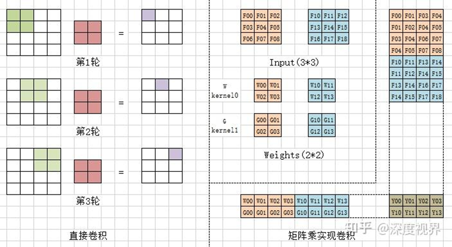
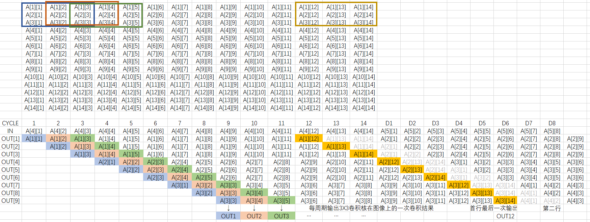
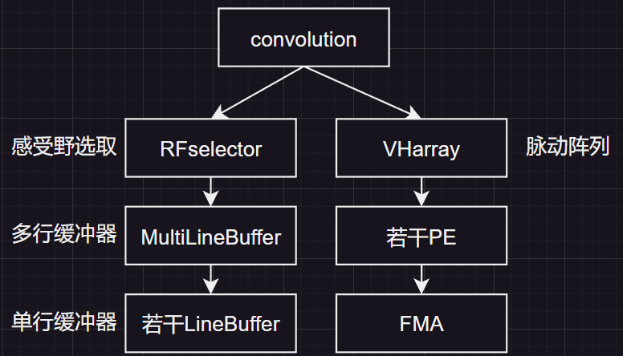
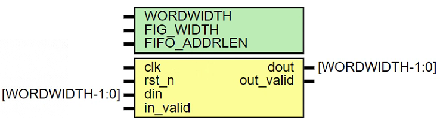
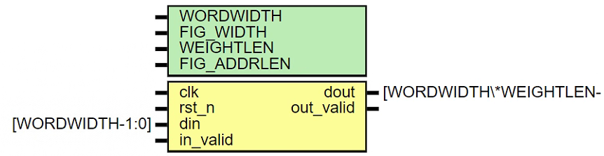
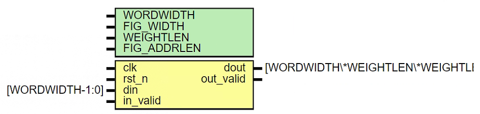

# 基于FPGA的LeNet-5脉动阵列结构加速器

# `任务书`

[TOC]

***

## 项目简介

🚀🚀本项目由课程《结构化集成电路设计》的大作业任务“基于ARM的CNN加速器（协处理器）设计”扩展而来，涉及的知识领域有FPGA、卷积神经网络、脉动阵列。目的为模拟FPGA开发的流程，锻炼代码、调试能力，丰富项目经历，让简历好看（主要）🎖️。

## 预期目标

🎈🎈按照大作业任务要求，需要完成卷积神经网络LeNet-5和ResNet中一层卷积层的加速运算，并将得到的对应输出存储到片上存储中并逐个读出用于验证，本项目将基于脉动阵列结构实现。

bonus: 在大作业任务要求的基础上，希望能够将加速器部署在实验室的板子Xilinx ZCU102上。此外，在有能力的情况下考虑完整实现LeNet-5并部署到开发板上，包括卷积层、池化层、全连接层。期望的效果为：PC端将摄像头数据实时传至开发板，板子实现LeNet-5模型推理后将结果传回PC端。但此功能将建立在更多调研的基础上，目前尚未开始。

项目预计持续1~2个月，起始时间为2月初，预期在返校后一个月内完成。鉴于寒假期间效率较低，主要工作可能还是在校期间完成，寒假主要完成调研任务和一些代码编写，期望返校后一周内可以上板调试。

## 主要原理

#### **总览**

项目的重点将放在卷积层加速上，目前调研围绕`数据的矩阵展开`、`脉动阵列`展开。

**代码参考**

这份代码是基于脉动阵列的卷积、池化实现，包括阵列的实现、数据提取的方式，具有很高的参考价值，建议阅读。

[odin2985/FPGA-CNN-accelerator-based-on-systolic-array: 2023集创赛国二，紫光同创杯。基于脉动阵列写的一个简单的卷积层加速器，支持yolov3-tiny的第一层卷积层计算，可根据FPGA端DSP资源灵活调整脉动阵列的结构以实现不同的计算效率。 (github.com)](https://github.com/odin2985/FPGA-CNN-accelerator-based-on-systolic-array)

#### **数据的矩阵展开**

在初期调研时已有对矩阵展开的讨论，记卷积核宽度为W、面积为A($A=W\cdot W$)，卷积核按行展开作为向量`W(Ax1)`，图像待卷积区域按行展开作为向量`F(1xA)`，进行向量乘积`P=F×W`，P即为核在图像上的一次乘积和。卷积核在图像上滑动，得到若干个向量`F`和`W`，向量的组合即为矩阵。

数据（图像）的提取大致为以下思路：

`对外接口`：数据按行顺序输入，每次输入一个数据，每次输出矩阵乘所需的一个向量F。

`内部实现`：观察下图的输出传输过程（设W=3，A=9，图宽L=14），前期输入数据`A[1][1]-A[3][14]`，模块依次存储。当输入`A[4][1]`时，`OUT[1]`输出第①（下面以此记法）个卷积框的第Ⅰ个数据`A[1][1]`，下一个周期输入`A[4][2]`，`OUT[2]`输出①的Ⅱ数据`A[1][2]`，同时`OUT[1]`输出②的Ⅰ数据`A[1][2]`，以次类推至12个周期时开始输入最后一个卷积框。我们发现A个输出被平均划分为W组，每组输出的值都相同，且都为同一列。由此，我们只需实现W个长度为L的移位寄存器（一行一个）即可实现对数据的滞留保存。（集创赛代码也有此实现，移位寄存器使用的是FIFO IP核）

#### **脉动阵列**

相比之下，脉动阵列的实现较为简单，思路为：

`对外接口`：输入矩阵乘所需的向量F和W，输出乘积和的结果。

`内部实现`：一个PE结构完成一次浮点乘加运算，共有A个，上一级输出作为下一级PE的输入，最后一级输出结果。

#### **其它**

- 从目前调研的情况看，数据为顺序输入，实时传输并运算，或许不需要指令架构

## 任务分解

项目不再使用课程提供的控制结构，采用自底向上的设计模式，先完成底层模块的实现，使用这种模式的考量是方便矩阵展开的实现，完成convolution层模块的实现后，再考虑顶层控制层的逻辑。代码结构如下

实行数据模块`RFselector`与计算模块`VHarray`分开，通过convolution调度数据。

`RFselector`为`Receptive Field Selector`，对应原理中的矩阵展开，负责输入数据从行顺序变换到感受野顺序。`VHarray`为`vertical Array`，对应原理中的脉动阵列运算器，只负责接受数据并顺序计算。

模块的对外接口如下

***

LineBuffer

***

MultiLineBuffer

***

RFselector

***

代码将同步在[dangwi/systolic-array-CNN-accelerator (github.com)](https://github.com/dangwi/systolic-array-CNN-accelerator)

#### **目前进度**

- 卷积加速器设计
- [ ] VHarray：已完成基础实现，待tb验证，PE模块为FMA的封装。
- [ ] RFselector：实现中，数据存储方式可能需改进
- 仿真、综合与上板
- [ ] AXI接口的调研
- [ ] 卷积层数据的产生

## 参考资料

* [odin2985/FPGA-CNN-accelerator-based-on-systolic-array(推荐阅读)](https://github.com/odin2985/FPGA-CNN-accelerator-based-on-systolic-array)
* [芯片的Systolic Array 脉动阵列设计加速矩阵乘运算 - kongchung - 博客园 (cnblogs.com)](https://www.cnblogs.com/kongchung/p/13227256.html)
* [计算机体系结构：脉动阵列 - 知乎 (zhihu.com)](https://zhuanlan.zhihu.com/p/650209037)

* [深度学习 CNN卷积神经网络 LeNet-5详解_基于lenet-5的cnn模型-CSDN博客](https://blog.csdn.net/happyorg/article/details/78274066)